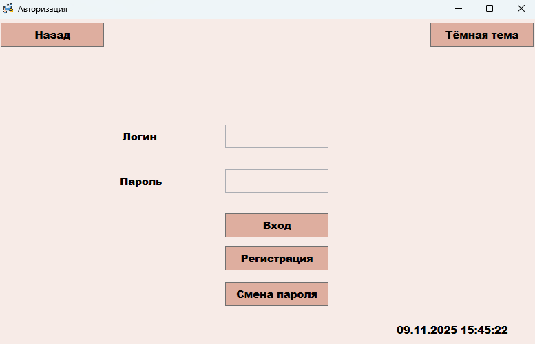
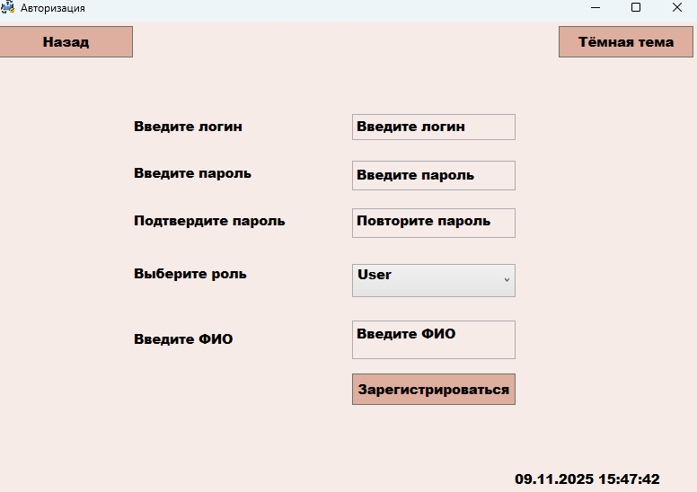
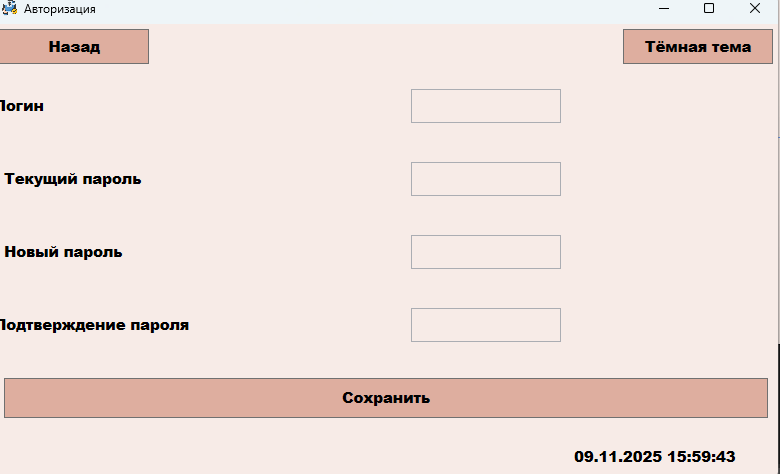
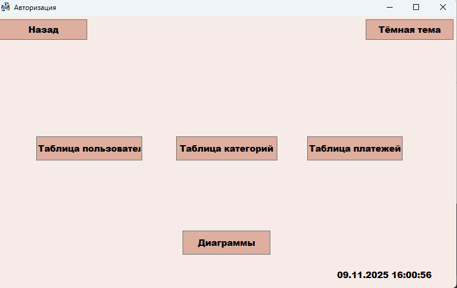
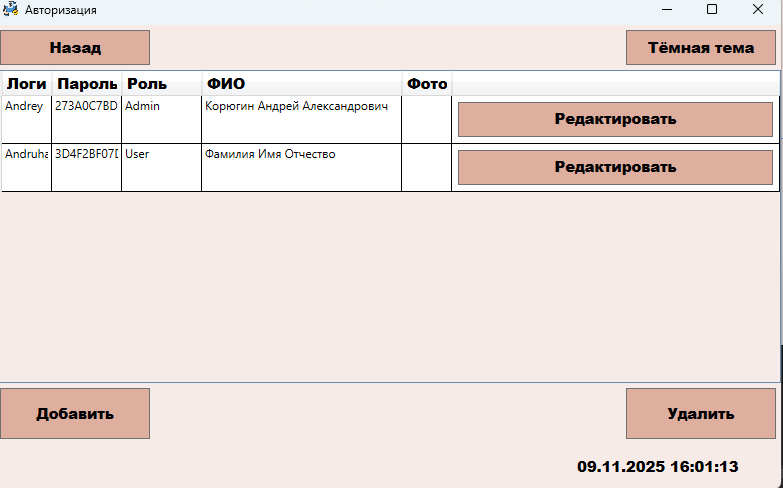
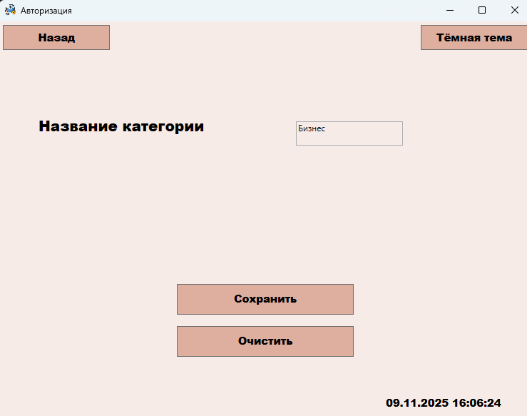
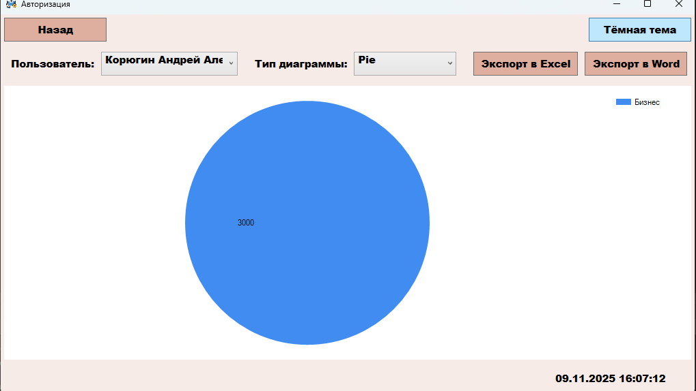

# WPF приложение для отслеживания платежей пользователей

Это приложение для отслеживания личных платежей с визуализацией расходов в виде диаграмм и возможностью управления платежеми админами.

##  Возможности

* **Аутентификация:** Регистрация пользователей, вход и смена паролей.
* **Управление данными:** Добавление, редактирование и удаление транзакций.
* **Визуализация:** Построение диаграмм разных видов по категориям расходов.
* **Экспорт данных:** Сохранение отчетов в форматах Word и Excel.
* **Поиск информации:** Фильтрация информации по ФИО пользователей.

## Скриншоты
В этом разделе представлены скриншоты работы программы

#### Страница авторизации

#### Страница регистрации

#### Страница смены пароля

#### Страница администратора

#### Типовая страница таблицы бд

#### Типовая страница изменения/добавления данных

#### Страница диаграмм и экспорта данных

### Инструкция по сборке

*  Откройте SQL Server Management Studio (SSMS)
*  Подключитесь к вашему экземпляру SQL Server
*  Создайте новую базу данных
*  Выполните предоставленный SQL-скрипт
*  Откройте WPF проект с помощью Visual Studio
*  Обновите строку подключения в файле App.config